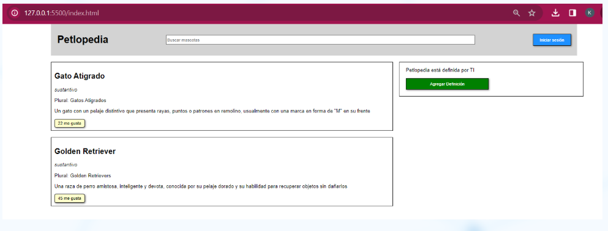
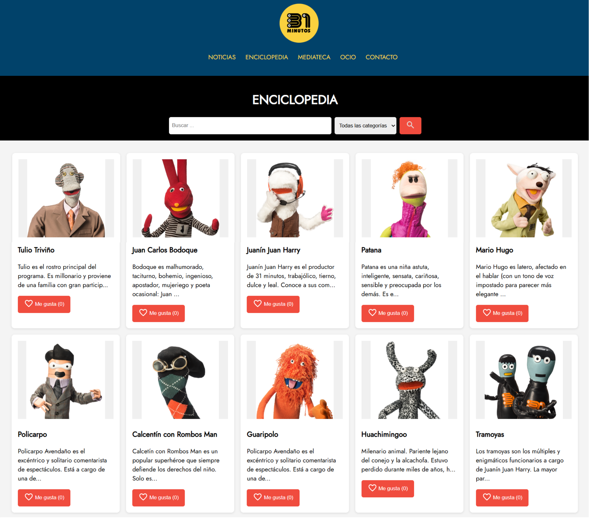

# Enciclopedia 31 minutos 

_Una enciclopedia interactiva inspirada en el universo de 31 Minutos, desarrollada como ejercicio de integración HTML, CSS y JavaScript. Este proyecto permite explorar personajes mediante tarjetas dinámicas, búsqueda por nombre y visualización de detalles en un modal._

## JavaScript en el buscador / Evento Onclick (Core) 🚀

_ ¿Sabes qué pasa cuando haces clic en un botón en una página web? ¡Bueno, eso es precisamente lo que vamos a aprender a hacer! Vamos a usar algo llamado “evento onclick”. Básicamente, nos permite hacer que ocurra algo entretenido cuando hacemos clic en algo en nuestra página._

## Pre-requisitos 🛠️

- Cuando se da clic en “Me gusta” para una de las definiciones se dispara una alarma indicando que te gusto la definición junto con el título de la misma.
- Cada vez que se le da clic al botón de like de cada definición, este debe aumentar el conteo de likes de cada definición.

## Características 🛠️

- Tarjetas generadas dinámicamente desde un array de objetos.
- Buscador por nombre con filtrado en tiempo real.
- Modal emergente con descripción completa del personaje.
- Botón de "Me gusta" con contador individual.
- Diseño responsivo.
  
## Deciciones 👌

_1. Los personajes se almacenan como objetos dentro de un array. Esto permite escalar fácilmente el contenido o integrarlo con una API futura._

**Código**  
<pre> 
  const personajes = [
  {
    titulo: "Tulio Triviño",
    descripcion: "Tulio es el rostro principal del programa...",
    imagen: "assets/img/tulio_trivino.png",
    likes: 0
  },
  ...
];
  </pre>

- Se optó por mantener los datos en el frontend para facilitar pruebas y evitar dependencias externas durante el desarrollo inicial.

_2. La función renderCards() se encarga de generar el HTML de cada tarjeta a partir del array. Esto permite reutilizar la lógica tanto para el render inicial como para los resultados filtrados._

**Código**  
<pre> 
  function renderCards(data) {
  cardContainer.innerHTML = "";
  data.forEach(personaje => {
    const card = document.createElement("div");
    card.className = "card";
    card.innerHTML = `...`;
    ...
    cardContainer.appendChild(card);
  });
}
  ...
];
  </pre>

- Se usó innerHTML para insertar contenido rápidamente, pero se encapsuló dentro de una función para mantener la lógica modular y reutilizable.
  
_3. El buscador filtra por coincidencia parcial en el título. Al hacer clic en una tarjeta, se despliega un modal con la descripción completa._

**Código**  
<pre> 
  searchBtn.addEventListener("click", () => {
  const query = searchInput.value.toLowerCase();
  const filtered = personajes.filter(p => p.titulo.toLowerCase().includes(query));
  renderCards(filtered);
});

  </pre>

**Código**  
<pre> 
  card.addEventListener("click", (e) => {
  if (e.target.classList.contains("likeBtn")) return;
  modalTitle.textContent = personaje.titulo;
  modalDescription.textContent = personaje.descripcion;
  modal.classList.remove("hidden");
});
  </pre>

- Se evitó que el clic en el botón "Me gusta" abra el modal usando e.target.classList.contains("likeBtn").

_4. Cada personaje tiene un contador de "likes" que se incrementa al hacer clic. Aunque no se persiste, permite simular interacción._

**Código**  
<pre> 
  likeBtn.addEventListener("click", () => {
  personaje.likes++;
  likeCount.textContent = personaje.likes;
  alert(`Te gusta "${personaje.titulo}"`);
});

  </pre>

- Se optó por un alert() como feedback inmediato. En versiones futuras, se puede reemplazar por una animación o persistencia en localStorage.

_Cómo consiguieron mi número beep usted se ha comunicado con el teléfono de Juan Carlos bodoque si él le da dinero este ya no es el teléfono de Juan Carlos bodoque_

---
⌨️ con ❤️ por [Katherine](https://github.com/mckateturry) 😊
